# 🦷 Diş Sağlığım - AI-Powered Dental Health Platform

## 🏆 Hackathon Projesi

**Diş Sağlığım**, yapay zeka destekli diş sağlığı analizi ve eğitimi sunan kapsamlı bir mobil uygulama ve backend platformudur. Modern Android geliştirme teknikleri ve AI entegrasyonu ile kullanıcıların ağız-diş sağlığını korumalarına yardımcı olmayı amaçlamaktadır.

---

## 🚀 Temel Özellikler

### 🤖 AI-Powered Diş Analizi
- **Akıllı Görüntü Analizi**: Kamera ile çekilen diş fotoğraflarını AI ile analiz eder
- **Gerçek Zamanlı Tespit**: Çürük, hipodonti ve diğer diş problemlerini %93.3 doğrulukla tespit eder
- **Detaylı Raporlar**: Analiz sonuçları ile birlikte öneriler ve risk değerlendirmesi sunar
- **Kişiselleştirilmiş Bakım Planları**: Google Gemini 2.5 Flash ile 7 günlük özel planlar

### 💬 AI Chat Asistanı
- **7/24 Destek**: Yapay zeka destekli chatbot ile anında diş sağlığı danışmanlığı
- **Sesli Etkileşim**: Speech-to-Text özellikleri
- **Doğal Dil İşleme**: Google Gemini ile sohbet etme 
- **Kişiselleştirilmiş Öneriler**: Kullanıcı sorularına göre özel çözümler

### 🎮 Oyunlaştırma Sistemi
- **Eğitici Quizler**: Diş sağlığı hakkında bilgi testleri
- **Rozet Sistemi**: Başarılar için özel rozetler ve ödüller
- **Skor Takibi**: Performans izleme ve gelişim takibi

### ⏰ Akıllı Hatırlatıcılar
- **Özelleştirilebilir Bildirimler**: Sabah/akşam fırçalama hatırlatıcıları
- **Exact Alarm Desteği**: Android 12+ için hassas zamanlama

---

## 🛠️ Teknoloji Stack

### **Mobile App (Android)**
- **Kotlin** - Modern Android geliştirme dili
- **ViewBinding** - Type-safe view erişimi
- **ConstraintLayout** - Performanslı layout sistemi
- **Material Design 3** - Google'ın en güncel tasarım prensipleri
- **Navigation Component** - Fragment geçişleri için güvenli navigasyon
- **Lottie** - Vektör animasyonları

### **Backend API**
- **FastAPI** - Yüksek performanslı web framework
- **Google Gemini 2.5 Flash** - Metin üretimi ve sohbet
- **Hugging Face Transformers** - Görüntü sınıflandırma (prithivMLmods/tooth-agenesis-siglip2)
- **PyTorch** - Makine öğrenmesi
- **Pillow** - Görüntü işleme
- **ngrok** - Geliştirme için tünelleme

### **Architecture & Patterns**
- **MVVM Pattern** - Model-View-ViewModel mimarisi
- **Repository Pattern** - Veri erişimi için merkezi yönetim
- **UseCase Pattern** - İş mantığı için temiz ayrım
- **LiveData** - Reactive programming
- **Clean Architecture** - Katmanlı mimari

### **Networking & API**
- **Retrofit 2.11.0** - RESTful API iletişimi
- **Gson** - JSON serialization/deserialization
- **OkHttp** - HTTP client ve logging
- **Base64 Encoding** - Görüntü optimizasyonu

### **System Integration**
- **Camera API** - Fotoğraf çekme ve galeri erişimi
- **NotificationManager** - Bildirim sistemi
- **AlarmManager** - Zamanlanmış görevler

---

## 🏗️ Proje Mimarisi

### **Clean Architecture**
```
📁 Mobile App (Android)
├── 📁 presentation/     # UI Katmanı (Fragment, ViewModel, Adapter)
├── 📁 domain/          # İş Mantığı Katmanı (Repository, UseCase, Model)
├── 📁 data/            # Veri Katmanı (Local, Remote, Repository Implementation)
├── 📁 infrastructure/  # Altyapı Servisleri (Notification, Background Services)
└── 📁 model/           # Veri Modelleri

📁 Backend API (Python)
├── 📁 main.py          # FastAPI sunucusu ve API endpoint'leri
├── 📁 image_analyzer.py # Görüntü sınıflandırma ve raporlama
├── 📁 dental_chatbot.py # Metin tabanlı sohbet asistanı
└── 📁 requirements.txt # Gerekli Python kütüphaneleri
```

### **API Endpoints**

**1. Görüntü Analizi**
```
POST /analyze
Content-Type: application/x-www-form-urlencoded

Parameters:
- user_id: string (required)
- image_b64: string (required) 
- symptom: string (optional)

Response:
{
  "top_predictions": ["Diş Eti İltihabı (Gingivitis): 85.2%"],
  "dental_comment": "Analiz sonuçlarına göre...",
  "weekly_plan": [{"day": "Pazartesi", "task": "..."}],
  "success": true
}
```

**2. Sohbet Asistanı**
```
POST /chat
Content-Type: application/x-www-form-urlencoded

Parameters:
- message: string (required)
- session_id: string (required)

Response:
{
  "reply": "Merhaba! Diş ağrısı için..."
}
```

---

## 📊 Performans & Doğruluk

### **AI Analiz Performansı**
- **Doğruluk Oranı**: %93.3 (Çürük tespiti)
- **Yanıt Süresi**: <3 saniye
- **Retry Mekanizması**: 3 deneme hakkı
- **Image Optimization**: Base64 encoding ile optimize edilmiş görüntü işleme

### **Uygulama Performansı**
- **ConstraintLayout**: LinearLayout'a göre %40 daha hızlı rendering
- **ViewBinding**: Null-safe view erişimi ile crash önleme
- **Memory Management**: Proper lifecycle management
- **API Timeout**: 30 saniye timeout

### **Backend Performansı**
- **FastAPI**: Yüksek performanslı async framework
- **Google Gemini**: Hızlı metin üretimi
- **PyTorch**: Optimize edilmiş ML modeli
- **ngrok**: Güvenli tünelleme

---

## 💡 Tüketici Faydası

### **Sağlık Faydaları**
- **Erken Teşhis**: AI destekli analiz ile potansiyel problemleri erken tespit
- **Maliyet Tasarrufu**: Erken müdahale ile tedavi maliyetlerini düşürme
- **Zaman Tasarrufu**: Evde hızlı analiz ile doktor randevusu öncesi bilgi
- **Bilgi Artışı**: Eğitici içerikler ile diş sağlığı bilinci

### **Sosyal Faydalar**
- **Toplum Sağlığı**: Genel diş sağlığı bilincini artırma
- **Eğitim**: Çocuklar için eğlenceli öğrenme deneyimi
- **Erişilebilirlik**: Herkes için kolay erişim
- **Dijital Sağlık**: Modern sağlık teknolojilerine adaptasyon

---

## 🚀 Kurulum ve Çalıştırma

### **Gereksinimler**
- Android Studio Arctic Fox+
- JDK 11+
- Android SDK 24+
- Python 3.8+
- Minimum 2GB RAM

### **Mobile App Kurulumu**
```bash
# Android uygulaması
git clone [repository-url]
cd PupilicaHackathon
./gradlew assembleDebug
```

### **Backend API Kurulumu**
```bash
# Backend servisi
cd dental-ai-backend
python -m venv venv
source venv/bin/activate  # Linux/Mac
# .\venv\Scripts\activate  # Windows
pip install -r requirements.txt

# Ortam değişkenleri
echo 'GEMINI_API_KEY="your_api_key_here"' > .env

# Sunucuyu başlat
python main.py

# ngrok ile tünelleme
./ngrok.exe http 8000
```

### **Tam Sistem Çalıştırma**
1. **Backend'i başlat** (Python FastAPI)
2. **ngrok ile tünelle** (mobil erişim için)
3. **Android uygulamasını çalıştır**
4. **API URL'ini güncelle** (ngrok URL'i)

---

##  Ekran Görüntüleri

###  OnBoarding Ekranı
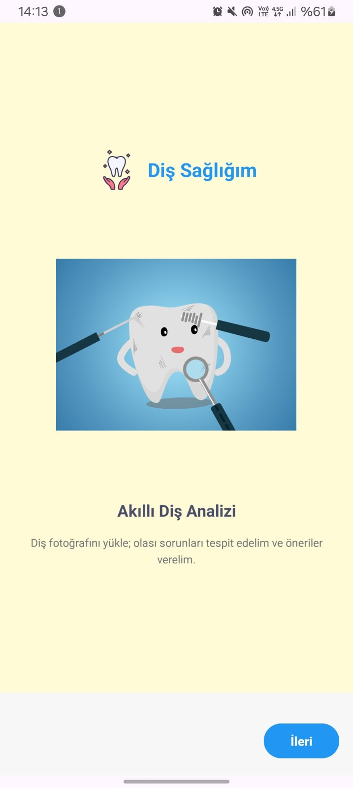 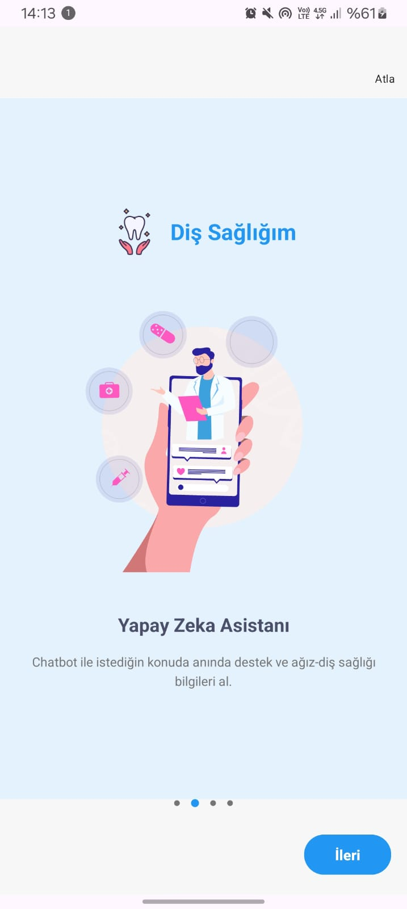
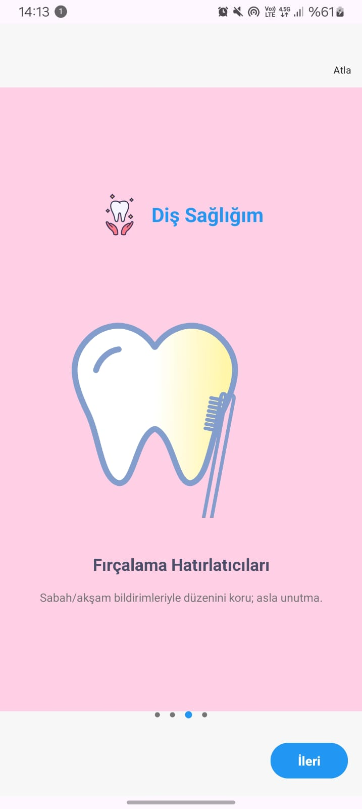 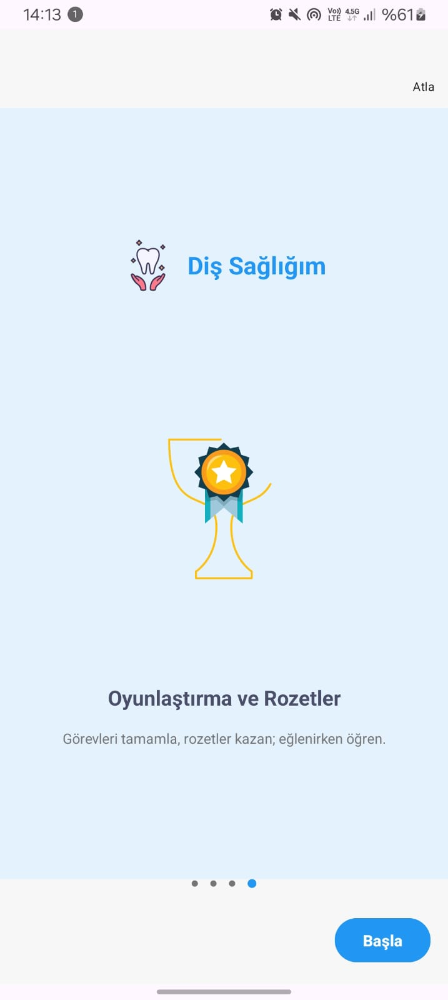

### AnaEkran Ekranı
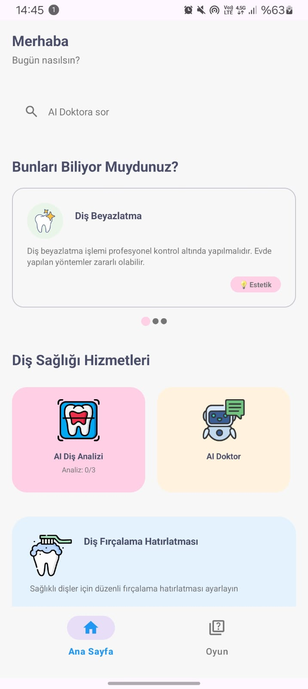 

###  Analiz Ekranı
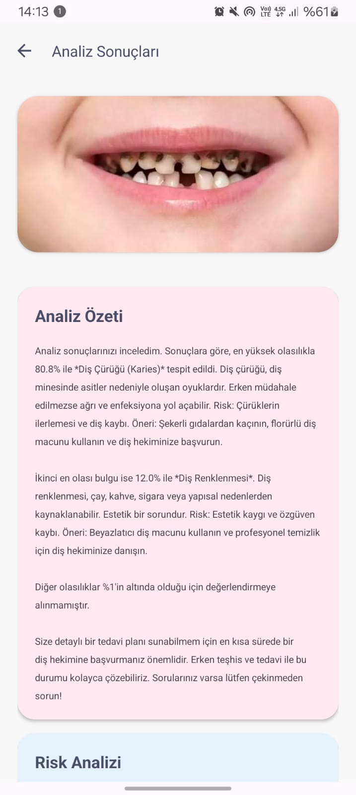 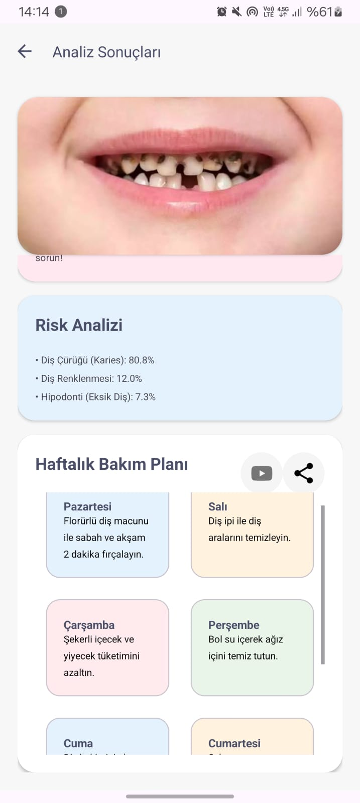

###  AI Doktor Ekranı (Chatbot)
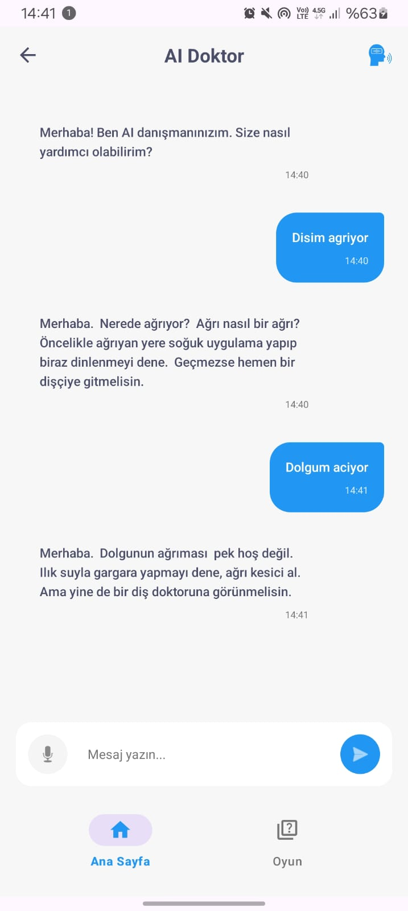

###  Oyun  Ekranı
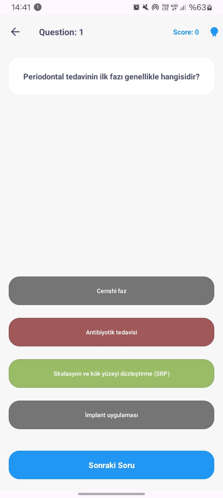 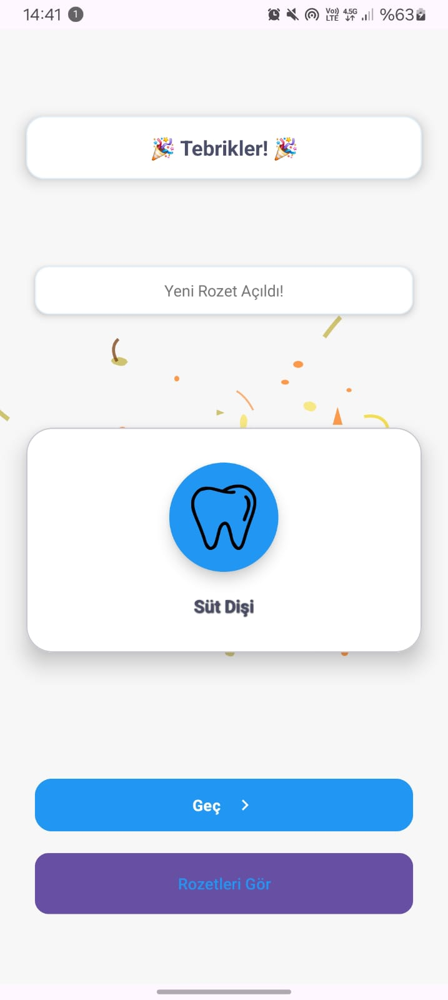 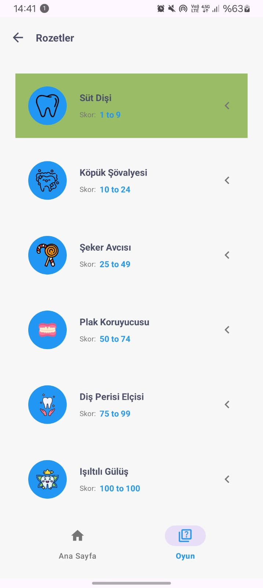

###  Diş Fırçalama Hatırlatıcısı
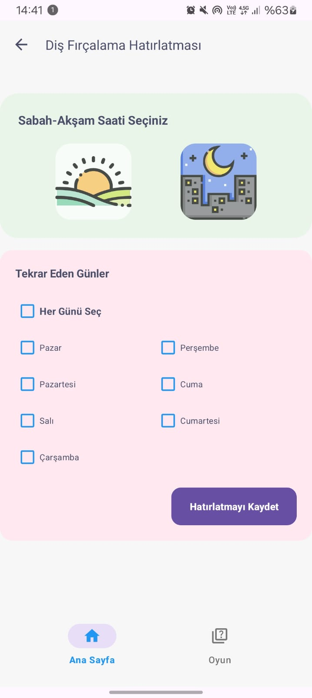 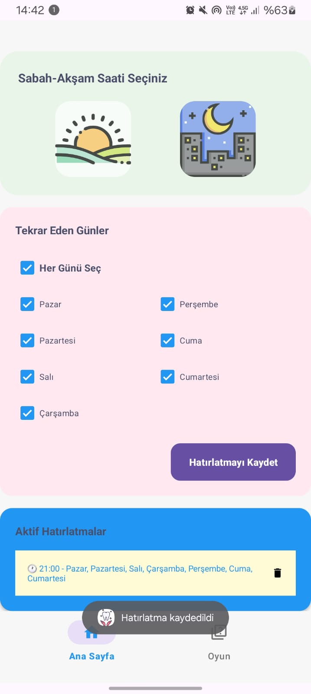

---

## 🔄 Sistem Akışı

### **Diş Analizi Süreci**
1. **Kullanıcı fotoğraf çeker** (Mobile App)
2. **Base64 formatına çevrilir** (Mobile App)
3. **API'ye gönderilir** (Retrofit)
4. **AI analizi yapılır** (Backend - PyTorch)
5. **Rapor oluşturulur** (Backend - Gemini)
6. **Sonuç gösterilir** (Mobile App)

### **Chatbot Süreci**
1. **Kullanıcı mesaj gönderir** (Mobile App)
2. **API'ye iletilir** (Retrofit)
3. **AI yanıt üretir** (Backend - Gemini)
4. **Yanıt gösterilir** (Mobile App)
5. **Sesli okuma** (TextToSpeech)
---
*Modern Android geliştirme teknikleri ve yapay zeka entegrasyonu ile diş sağlığı alanında yenilikçi bir çözüm. 🦷✨*
